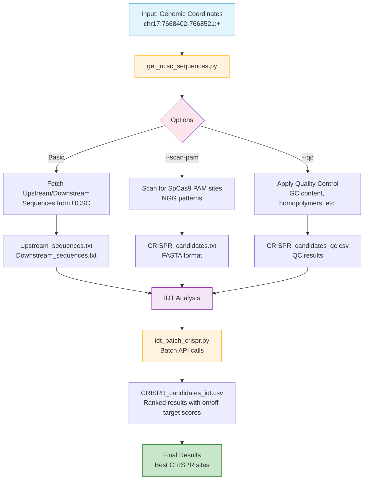

# CRISPR Target Automation

A modular pipeline for CRISPR gRNA choosing using UCSC Genome Browser and IDT CRISPR tools.

## 🔄 Pipeline Overview



## 🧬 Modular Scripts that can be ran as a pipeline or as individual tasks

#### 1. **`utils/get_ucsc_sequences.py`** - Fetch Sequences Only
**When to use:** You want to get DNA sequences from UCSC but analyze them elsewhere

```bash
# Basic usage 
python utils/get_ucsc_sequences.py targets.txt

# Single coordinate
python utils/get_ucsc_sequences.py chr17:7668402-7668421:+

# Scan for PAM sites
python utils/get_ucsc_sequences.py chr17:7668402-7668421:+ --scan-pam

# With quality control
python utils/get_ucsc_sequences.py targets.txt --scan-pam --qc
```

**Note:** All parameters (distances, genome, QC settings) are controlled by `config.yaml` and `policy.yaml` for reproducibility.

**Input:** Genomic coordinates only (e.g., `chr17:7668402-7668421:+`)
**Output:** 
- `Upstream_sequences.txt` - Upstream DNA sequences (FASTA format)
- `Downstream_sequences.txt` - Downstream DNA sequences (FASTA format)
- `CRISPR_candidates.txt` - PAM sites in FASTA format (if `--scan-pam` used)
- `CRISPR_candidates_qc.csv` - QC results for PAM sites (if `--qc` used)

**PAM Scanning:** Use `--scan-pam` to automatically find SpCas9 PAM sites (NGG) in the sequences and output CRISPR candidates in CSV format.

---

#### 2. **`utils/idt_batch_crispr.py`** - Analyze Existing Sequences
**When to use:** You already have FASTA files and want IDT analysis

**Uses:** https://eu.idtdna.com/site/order/designtool/index/CRISPR_SEQUENCE

```bash
# Test IDT connection
python utils/idt_batch_crispr.py

# Analyze one file
python utils/idt_batch_crispr.py sequences.txt

# Analyze multiple files
python utils/idt_batch_crispr.py upstream.txt downstream.txt exon.txt
```

**Input:** FASTA-style .txt files
**Output:** `{filename}_idt.csv` with ranked results
- Contains columns: `sequence_name`, `dna_sequence`, `on_target_score`, `off_target_score`, `on_plus_off`
- Sorted by `on_plus_off` (highest scores first)

---

#### 3. **`run_pipeline.py`** - Complete Pipeline (Recommended)
**When to use:** You want the full workflow from chromosome coordinates to ranked results

```bash
# Complete pipeline
python run_pipeline.py targets.txt --scan-pam --qc

# With guide selection
python run_pipeline.py targets.txt --scan-pam --qc --select-guides
```

#### 4. **`utils/run_CRISPR_target_automation.py`** - Advanced Pipeline
**When to use:** You need more control over the pipeline execution

```bash
# Complete pipeline
python utils/run_CRISPR_target_automation.py targets.txt --scan-pam --qc
```

**Input:** Genomic coordinates only
**Output:** Complete analysis with ranked results
- `Upstream_sequences_idt.csv` - Ranked upstream CRISPR sites
- `Downstream_sequences_idt.csv` - Ranked downstream CRISPR sites
- `CRISPR_candidates_idt.csv` - Ranked PAM sites (if --scan-pam used)

---

## 🎯 Which Script Should I Use?

| Your Situation | Use This Script | Why |
|----------------|-----------------|-----|
| I have coordinates, want full analysis | `python run_pipeline.py targets.txt --scan-pam --qc` | Complete pipeline with PAM + QC |
| I have coordinates, want sequences + PAM + QC | `python utils/get_ucsc_sequences.py targets.txt --scan-pam --qc` | Find and filter CRISPR targets |
| I have coordinates, want sequences + PAM only | `python utils/get_ucsc_sequences.py targets.txt --scan-pam` | Find CRISPR targets (no filtering) |
| I have coordinates, want up/downstream sequences only | `python utils/get_ucsc_sequences.py targets.txt` | Just fetch sequences |
| I have FASTA files, want IDT analysis | `python utils/idt_batch_crispr.py file1.txt [file2.txt]` | Analyze existing sequences |
| I want to test IDT connection | `python utils/idt_batch_crispr.py` | Quick connectivity test |
| I want to select top guides from IDT results | `python utils/select_top_guides.py results_idt.csv` | Filter and rank guides |

---

## 🛠️ Additional Utility Scripts

#### **`utils/select_top_guides.py`** - Guide Selection
**When to use:** You have IDT results and want to select the best guides based on policy criteria

```bash
# Select top guides from IDT results
python utils/select_top_guides.py CRISPR_candidates_idt.csv

# Select from multiple IDT result files
python utils/select_top_guides.py file1_idt.csv file2_idt.csv
```

#### **`utils/qc_ucsc_seq.py`** - Quality Control
**When to use:** You have PAM candidates and want to apply QC filters

```bash
# Apply QC to PAM candidates
python utils/qc_ucsc_seq.py CRISPR_candidates.txt --output qc_results.csv
```

#### **`utils/manifest.py`** - Run Tracking
**When to use:** You want to create a manifest for reproducibility tracking

```bash
# Create a basic manifest
python utils/manifest.py --config config.yaml --policy policy.yaml

# Create manifest with custom stats
python utils/manifest.py --config config.yaml --policy policy.yaml --stats '{"n_guides": 1000, "passed_qc": 850}'
```

---

## ⚙️ Configuration

Edit `config.yaml` to customize:

```yaml
# UCSC Sequence Fetching Settings
ucsc:
  upstream_distance: 100
  downstream_distance: 100
  genome_assembly: "hg38"
  retries: 3

# IDT Analysis Settings
idt:
  batch_size: 10
  timeout: 60
  session_cookie: "ASP.NET_SessionId=YOUR_SESSION_ID_HERE; ..."
  upstream_results: "Upstream_sequences_idt.csv"
  downstream_results: "Downstream_sequences_idt.csv"

# Quality Control Settings
qc:
  gc_min: 0.35
  gc_max: 0.65
  max_poly_t: 4
  max_homopolymer: 5
  restriction_sites:
    - "GAATTC"  # EcoRI
    - "AAGCTT"  # HindIII
    - "GGATCC"  # BamHI
    - "GGTACC"  # KpnI
    - "GCGGCCGC"  # NotI

# System Settings
system:
  python_cmd: "python3"
  verbose: 1
```

**Important**: You must update the `session_cookie` in `config.yaml` with your valid IDT session cookie.

---

## 📊 Output Files

#### **Basic Sequence Files:**
- `Upstream_sequences.txt` - Upstream DNA sequences (FASTA format)
- `Downstream_sequences.txt` - Downstream DNA sequences (FASTA format)

#### **PAM Analysis Files:**
- `CRISPR_candidates.txt` - PAM sites in FASTA format (if --scan-pam used)
- `CRISPR_candidates_qc.csv` - QC results for PAM sites (if --qc used)

#### **IDT Analysis Files:**
- `CRISPR_candidates_idt.csv` - Ranked PAM sites (if --scan-pam used)

**CRISPR_candidates_idt columns:**
- `sequence_name` - Original identifier
- `dna_sequence` - The actual DNA sequence
- `on_target_score` - IDT on-target analysis
- `off_target_score` - IDT off-target analysis
- `on_plus_off` - Combined score (higher = better)

---

## 🚀 Quick Start

1. **Set up your cookie** in `config.yaml`
2. **Create a targets.txt file** with gene coordinates:
   ```
   chr17:7668402-7668421:+
   ```
3. **Run the pipeline:**
   ```bash
   python run_pipeline.py targets.txt --scan-pam --qc 
   ```
4. **Open the results** in Excel and sort by `on_plus_off` column

---

## 📋 Input Format

The targets.txt file supports coordinates format only:

**Coordinates:**
```
chr14:103928378-103928397:+
chr1:1000000-1000020:-
chr17:7668402-7668421:+
```

**Format:** `chr:start-end:strand`

**Note:** Gene names are not supported to avoid ambiguity. Use coordinates instead.

---

## 🔑 How to Get Your IDT Session Cookie

The IDT CRISPR API requires a temporary browser session cookie to authenticate your requests. Follow these simple steps to get yours:

#### Instructions

1. **Open IDT CRISPR Designer**
   - Go to: https://eu.idtdna.com/site/order/designtool/index/CRISPR_SEQUENCE

2. **Open Developer Tools**
   - **Mac**: `Cmd + Option + I`
   - **Windows/Linux**: `Ctrl + Shift + I`

3. **Navigate to Network Tab**
   - Click on the "Network" tab in developer tools

4. **Reload the Page**
   - Press `F5` or `Cmd+R` to refresh
   - This populates the Network panel with requests

5. **Find IDT Request**
   - Look for any request to `eu.idtdna.com`
   - Click on it to inspect

   
   *The Cookie header is highlighted in red - this is what you need to copy!*

6. **Copy Cookie Value**
   - In the right panel: **Headers** → **Request Headers**
   - Find the line starting with `Cookie:`
   - Copy the entire cookie string

7. **Update config.yaml**
   ```yaml
   idt:
     session_cookie: "ASP.NET_SessionId=your_session_id; Anon=your_anon_id; ..."
   ```

#### ⚠️ Important Notes

- **Cookies expire every few hours** — if the script stops returning scores, just refresh your cookie
- **Keep your cookie private** — don't share it publicly
- **Example cookie format**:
  ```
  ASP.NET_SessionId=dzzwdv3adomtkqept1zgp0hc; Anon=t6ocoWScxF8=; ARRAffinity=874c5298ae0e2eca12812a980102a414521df46497427d5bbed67654bd42654b
  ```

#### 🔧 Troubleshooting

**❌ Getting "Authentication failed" errors?**
- Your cookie has expired → Get a fresh one using the steps above

**❌ Can't find the Cookie header?**
- Make sure you're looking in **Request Headers** (not Response Headers)!
- Scroll down once inside Headers (You should see General, Response Headers, Request Headers)
- Try reloading the page and looking for requests to `eu.idtdna.com`

## 🔧 Requirements

- Python 3.6+
- Required Python packages: `requests`, `pandas`, `PyYAML`
- Valid IDT session cookie (update in `config.yaml`)
- see requirements.txt

---

## 🛠️ Troubleshooting

**Session expired**: Update the `session_cookie` in `config.yaml`

**Network timeouts**: Increase `timeout` in the `idt` section of `config.yaml`

**Verbose output**: Set `verbose: 1` in the `system` section of `config.yaml`

---

## 🧪 Lab Usage

1. Copy the entire `CRISPR_target_automation` folder
2. Update the IDT session cookie in `config.yaml`
3. Create your targets.txt file
4. Run: `python run_pipeline.py targets.txt --scan-pam --qc`

## Future Notes
- In future versions, grepping IDT cookie could be automated by fetching an anonymous session cookie via requests.get(), but for stability and reproducibility, the current version uses a user-supplied cookie.