# GuideForge - Automated CRISPR gRNA Design Pipeline

A modular pipeline for CRISPR gRNA choosing using UCSC Genome Browser and IDT (Integrated DNA Technologies) CRISPR tools. The pipeline supports group-specific gRNA design specifications through policy.yaml and produces a manifest log per run for reproducibility tracking. The pipeline includes a configurable PAM scanner supporting multiple PAM patterns and comprehensive quality control filtering.

---

## 🚀 Quick Start

1. **Set up your IDT session cookie** in `config.yaml`
2. **Create targets.txt** with your coordinates:
   ```bash
   echo "chr17:7668402-7668521:+" > targets.txt # or manual addition
   ```
3. **Run the pipeline:**
   ```bash
   make run
   ```

**That's it!** You'll get  CRISPR gRNA sequences ranked by IDT's on + off targets scores.


## 🛠️ Quick Commands (Makefile)

For convenience, you can use these simple commands:

```bash
# Install dependencies
make install

# Run full pipeline
make run

# Quick test (no IDT tested)
make test

# Clean up generated files (logs, csvs, but does not remove the manifest)
make clean

# Show all available make commands
make help
```

**Note:** The `make run` command expects a `targets.txt` file with your coordinates.


## 🔄 Pipeline Overview

```mermaid
flowchart TD
    A["🧬 Input: Genomic Coordinates<br/>chr17:7668402-7668521:+"] --> B["🚀 run_pipeline.py<br/>Main Pipeline"]

    B --> C{Choose Analysis Level}
    C -->|Basic| D["📥 Fetch Sequences<br/>UCSC Genome Browser"]
    C -->|+PAM| E["🔍 Find CRISPR Sites<br/>SpCas9 NGG patterns"]
    C -->|+QC| F["✅ Quality Control<br/>GC, homopolymers, motifs"]

    D --> G["📄 Upstream_sequences.txt<br/>📄 Downstream_sequences.txt"]
    E --> H["📄 CRISPR_candidates.txt<br/>FASTA format"]
    F --> I["📊 CRISPR_candidates_qc.csv<br/>QC results"]

    G --> J["🧪 IDT Analysis<br/>On/Off-target Scoring"]
    H --> J
    I --> J

    J --> K["📈 CRISPR_candidates_idt.csv<br/>Ranked by combined score"]
    K --> L["🏆 Top Results<br/>Best CRISPR guides ready for experiments"]

    style A fill:#e1f5fe,stroke:#0277bd,stroke-width:2px
    style B fill:#fff3e0,stroke:#ffb300,stroke-width:2px
    style C fill:#fce4ec,stroke:#e91e63,stroke-width:2px
    style J fill:#f3e5f5,stroke:#8e24aa,stroke-width:2px
    style L fill:#c8e6c9,stroke:#2e7d32,stroke-width:2px
```



## 🧬 How to use

#### 1. **`run_pipeline.py`** - Complete Pipeline (Recommended)
**When to use:** You want the full workflow from chromosome coordinates to ranked results

```bash
# Complete pipeline
python run_pipeline.py targets.txt --scan-pam --qc

# With guide selection
python run_pipeline.py targets.txt --scan-pam --qc --select-guides
```

**Note**: Only QC-passing candidates are sent to IDT. The speed of IDT analysis depends on the IDT tool's response time, which may take several minutes for large batches.

---

#### 2. **`utils/get_ucsc_sequences.py`** - Fetch & Analyze Sequences
**When to use:** You want sequences + PAM sites + QC, but handle sequence selection elsewhere

```bash

# Basic usage - get up/downstream sequences 
python utils/get_ucsc_sequences.py targets.txt

# Get up/downstream sequences + scan for PAM sites
python utils/get_ucsc_sequences.py targets.txt --scan-pam

# Get sequences + scan PAM sites + apply quality control
python utils/get_ucsc_sequences.py targets.txt --scan-pam --qc

```

**Note:** All parameters (distances, genome, QC settings) are controlled by `config.yaml` and `policy.yaml` for reproducibility.

**Input:** Genomic coordinates only (e.g., `chr17:7668402-7668421:+`)
**Output:** 
- `Upstream_sequences.txt` - Upstream DNA sequences (FASTA format)
- `Downstream_sequences.txt` - Downstream DNA sequences (FASTA format)
- `CRISPR_candidates.txt` - PAM sites in FASTA format (if `--scan-pam` used)
- `CRISPR_candidates_qc.csv` - QC results for PAM sites (if `--qc` used)

**PAM Scanning:** Use `--scan-pam` to automatically find SpCas9 PAM sites (NGG) in the sequences and output CRISPR candidates in CSV format.

---

#### 3. **`utils/idt_batch_crispr.py`** - Analyze Existing Sequences
**When to use:** You already have FASTA files and want IDT on/off target scores

**Uses:** https://eu.idtdna.com/site/order/designtool/index/CRISPR_SEQUENCE

```bash
# Test IDT connection if run without txt files
python utils/idt_batch_crispr.py

# Analyze one file
python utils/idt_batch_crispr.py sequences.txt

# Analyze multiple files
python utils/idt_batch_crispr.py upstream.txt downstream.txt exon.txt
```

**Input:** FASTA-style .txt files
**Output:** `{filename}_idt.csv` with ranked results (ranked with the on_plus_off column)
- Contains columns: `sequence_name`, `dna_sequence`, `on_target_score`, `off_target_score`, `on_plus_off`
- Sorted by `on_plus_off` (highest scores first)


## 🎯 Which Script Should I Use?

| Your Situation | Use This Script | Why |
|----------------|-----------------|-----|
| I have coordinates, want full analysis | `python run_pipeline.py targets.txt --scan-pam --qc` | Complete pipeline with PAM + QC + automatic manifest |
| I have coordinates, want full analysis + pick top guides  | `python run_pipeline.py targets.txt --scan-pam --qc --select-guides` | Complete pipeline with automatic guide selection |
| I have coordinates, want sequences + PAM + QC | `python utils/get_ucsc_sequences.py targets.txt --scan-pam --qc` | Find and filter CRISPR targets |
| I have coordinates, want sequences + PAM only | `python utils/get_ucsc_sequences.py targets.txt --scan-pam` | Find CRISPR targets (no filtering) |
| I have coordinates, want up/downstream sequences only | `python utils/get_ucsc_sequences.py targets.txt` | Just fetch sequences |
| I have FASTA files, want IDT analysis | `python utils/idt_batch_crispr.py file1.txt [file2.txt]` | Analyze existing sequences |
| I want to test IDT connection | `python utils/idt_batch_crispr.py` | Quick connectivity test |
| I want to select top guides from IDT results | `python utils/select_top_guides.py results_idt.csv` | Filter and rank guides |

---

## 🛠️ Additional Utility Scripts

#### **`utils/select_top_guides.py`** - Guide Selection
**When to use:** You have IDT results and want to select the best guides based on policy criteria

```bash
# Select top guides from IDT results
python utils/select_top_guides.py CRISPR_candidates_idt.csv

# Select from multiple IDT result files
python utils/select_top_guides.py file1_idt.csv file2_idt.csv
```

#### **`utils/qc_ucsc_seq.py`** - Quality Control
**When to use:** You have PAM candidates and want to apply QC filters

```bash
# Apply QC to PAM candidates
python utils/qc_ucsc_seq.py CRISPR_candidates.txt --output qc_results.csv
```

#### **`utils/manifest.py`** - Run Tracking
**When to use:** Manifests are automatically created per full pipeline run - no manual creation needed!


```bash
# Compare two runs to see what changed
python utils/manifest.py --compare manifest_run1.json manifest_run2.json
```

---

## ⚙️ Configuration

Edit `config.yaml` to customize:

```yaml
# UCSC Sequence Fetching Settings
ucsc:
  upstream_distance: 100
  downstream_distance: 100
  genome_assembly: "hg38"
  retries: 3

# PAM Scanning Settings
pam_scanning:
  pattern: "NGG"  # PAM pattern (required: NGG, RGG, VGG, etc.)

# IDT Analysis Settings
idt:
  batch_size: 10
  timeout: 60
  session_cookie: "ASP.NET_SessionId=YOUR_SESSION_ID_HERE; ..."

# Output File Settings
outputs:
  upstream_sequences: "Upstream_sequences.txt"
  downstream_sequences: "Downstream_sequences.txt"
  crispr_candidates: "CRISPR_candidates.txt"
  crispr_candidates_qc: "CRISPR_candidates_qc.csv"
  top_guides: "top_CRISPR_candidates_idt.csv"

# System Settings
system:
  python_cmd: "python3"
  verbose: 1
```

**Important**: You must update the `session_cookie` in `config.yaml` with your valid IDT session cookie.

**Customization**: You can customize output file names in the `outputs` section of `config.yaml`.

**PAM Patterns**: You must specify the PAM pattern in the `pam_scanning` section of config.yaml. Supported patterns:
- `NGG` - Any nucleotide + GG (SpCas9)
- `RGG` - Purine + GG (A or G)
- `VGG` - Not T + GG (A, C, or G)
- `SGG` - Strong + GG (G or C)
- Custom patterns using ambiguity codes: N=any, R=AG, Y=CT, S=GC, W=AT, K=GT, M=AC, B=CGT, D=AGT, H=ACT, V=ACG

---

## 🏛️ Group-Specific gRNA Design Specifications

The pipeline supports customizable gRNA design specifications through `policy.yaml`, allowing different research groups to define their own quality control parameters and selection criteria.

### Policy Configuration

Edit `policy.yaml` to customize your group's gRNA design standards:

```yaml
# Quality Control Parameters
quality_control:
  gc_min: 0.35          # Minimum GC content
  gc_max: 0.65          # Maximum GC content
  max_poly_t: 4         # Maximum consecutive T's
  max_homopolymer: 5    # Maximum homopolymer length
  restriction_sites:    # Sites to avoid
    - "GAATTC"          # EcoRI
    - "AAGCTT"          # HindIII
    - "GGATCC"          # BamHI

# Guide Selection Parameters
guide_selection:
  num_guides_per_gene: 5      # Number of guides to select per target
  min_on_target_score: 40     # Minimum IDT on-target score
  min_off_target_score: 70    # Minimum off-target score
  accepted_pams: ["NGG"]      # Accepted PAM sequences
  min_spacing_bp: 30          # Minimum spacing between guides

# Project Metadata
metadata:
  project_context: "macrophage knockout validation"
  notes: "Applies standard Cas9 rules; validated for CD14+ RNA-seq follow-up"
  genome_build: "hg38"
```

### Benefits of Policy-Based Configuration

- **Reproducibility**: All group members use identical parameters
- **Flexibility**: Easy to adjust criteria for different experimental needs
- **Documentation**: Policy files serve as living documentation of design standards
- **Version Control**: Track changes to design criteria over time

---

## 📋 Automatic Manifest Generation

Every pipeline run automatically creates a `manifest.json` file for reproducibility tracking. This includes:

- **Run metadata**: Timestamp, user, system information, Python version
- **Configuration tracking**: MD5 hashes of config.yaml and policy.yaml files
- **Pipeline parameters**: Genome assembly, distances, PAM pattern, enabled features
- **Summary statistics**: Target counts, QC pass rates, runtime, file counts
- **Reproducibility**: Compare manifests between runs to detect changes

#### Example
```json
{
  "run_id": "2024-01-15T10:30:45Z",
  "guideforge_version": "1.1.0",
  "backend": "IDT",
  "genome_assembly": "hg38",
  "config_hash": "a1b2c3d",
  "policy_hash": "e4f5g6h",
  "python_version": "3.9.7",
  "user": "researcher",
  "hostname": "lab-workstation-01",
  "pipeline_type": "full_automation",
  "targets_processed": 5,
  "pam_candidates_found": 150,
  "total_passed_qc": 120,
  "total_failed_qc": 30,
  "qc_pass_rate": 0.8,
  "idt_files_processed": 1,
  "idt_results_generated": 120,
  "upstream_distance": 100,
  "downstream_distance": 100,
  "pam_scanning_enabled": true,
  "pam_pattern": "NGG",
  "qc_enabled": true,
  "total_runtime_sec": 45.2
}
```

**Benefits:**
- **Audit Trail**: Track all pipeline runs and their parameters automatically
- **Troubleshooting**: Identify when configuration changes affected results
- **Collaboration**: Share exact run conditions with collaborators
- **Publication**: Include manifest data for reproducibility in papers

---

## 📊 Output Files

#### **Basic Sequence Files:**
- `Upstream_sequences.txt` - Upstream DNA sequences (FASTA format)
- `Downstream_sequences.txt` - Downstream DNA sequences (FASTA format)

#### **PAM Analysis Files:**
- `CRISPR_candidates.txt` - PAM sites in FASTA format (if --scan-pam used)
- `CRISPR_candidates_qc.csv` - QC results for PAM sites (if --qc used)

#### **IDT Analysis Files:**
- `CRISPR_candidates_idt.csv` - Ranked PAM sites (if --scan-pam used)
- `top_CRISPR_candidates_idt.csv` - Top selected guides (if --select-guides used)


**CRISPR_candidates_idt columns:**
- `sequence_name` - Original identifier
- `dna_sequence` - The actual DNA sequence
- `on_target_score` - IDT on-target analysis
- `off_target_score` - IDT off-target analysis
- `on_plus_off` - Combined score (higher = better)

#### **Reproducibility Files:**
- `manifest.json` - Run metadata and configuration tracking (created automatically)

---

## 📋 Input Format

The targets.txt file supports coordinates format only:

**Coordinates:**
```
chr14:103928378-103928397:+
chr1:1000000-1000020:-
chr17:7668402-7668421:+
```

**Format:** `chr:start-end:strand`

**Note:** Gene names are not supported to avoid ambiguity. Use coordinates instead.

---

## 🔑 How to Get Your IDT Session Cookie

The IDT CRISPR API requires a temporary browser session cookie to authenticate your requests. Follow these simple steps to get yours:

#### Instructions

1. **Open IDT CRISPR Designer**
   - Go to: https://eu.idtdna.com/site/order/designtool/index/CRISPR_SEQUENCE

2. **Open Developer Tools**
   - **Mac**: `Cmd + Option + I`
   - **Windows/Linux**: `Ctrl + Shift + I`

3. **Navigate to Network Tab**
   - Click on the "Network" tab in developer tools

4. **Reload the Page**
   - Press `F5` or `Cmd+R` to refresh
   - This populates the Network panel with requests

5. **Find IDT Request**
   - Look for any request to `eu.idtdna.com`
   - Click on it to inspect

   
   *The Cookie header is highlighted in red - this is what you need to copy!*

6. **Copy Cookie Value**
   - In the right panel: **Headers** → **Request Headers**
   - Find the line starting with `Cookie:`
   - Copy the entire cookie string

7. **Update config.yaml**
   ```yaml
   idt:
     session_cookie: "ASP.NET_SessionId=your_session_id; Anon=your_anon_id; ..."
   ```

#### ⚠️ Important Notes

- **Cookies expire every few hours** — if the script stops returning scores, just refresh your cookie
- **Keep your cookie private** — don't share it publicly
- **Example cookie format**:
  ```
  ASP.NET_SessionId=dzzwdv3adomtkqept1zgp0hc; Anon=t6ocoWScxF8=; ARRAffinity=874c5298ae0e2eca12812a980102a414521df46497427d5bbed67654bd42654b
  ```

#### 🔧 Troubleshooting

**❌ Getting "Authentication failed" errors?**
- Your cookie has expired → Get a fresh one using the steps above

**❌ Can't find the Cookie header?**
- Make sure you're looking in **Request Headers** (not Response Headers)!
- Scroll down once inside Headers (You should see General, Response Headers, Request Headers)
- Try reloading the page and looking for requests to `eu.idtdna.com`

## 🔧 Requirements

- Python 3.9+
- Required Python packages: `requests`, `pandas`, `PyYAML`
- Valid IDT session cookie (update in `config.yaml`)
- see requirements.txt

---

## 🛠️ Troubleshooting

**Session expired**: Update the `session_cookie` in `config.yaml`

**Network timeouts**: Increase `timeout` in the `idt` section of `config.yaml`

**Verbose output**: Set `verbose: 1` in the `system` section of `config.yaml`

---

## 🧪 Lab Usage

1. Copy the entire `CRISPR_target_automation` folder
2. Update the IDT session cookie in `config.yaml`
3. Create your targets.txt file
4. Run: `python run_pipeline.py targets.txt --scan-pam --qc`

## 🧪 Testing and Development

**Note:** The CI pipeline uses mock IDT responses for testing to ensure stability and security. Real IDT analysis requires valid session cookies which cannot be stored in public repositories.

## Future Notes
- In future versions, grepping IDT cookie could be automated by fetching an anonymous session cookie via requests.get(), but for stability and reproducibility, the current version uses a user-supplied cookie.